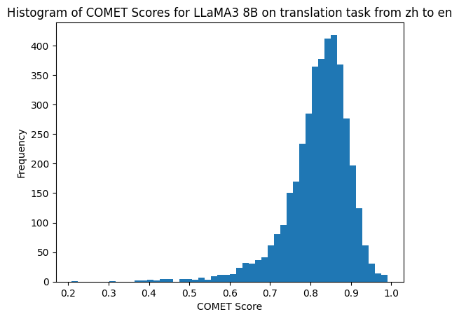
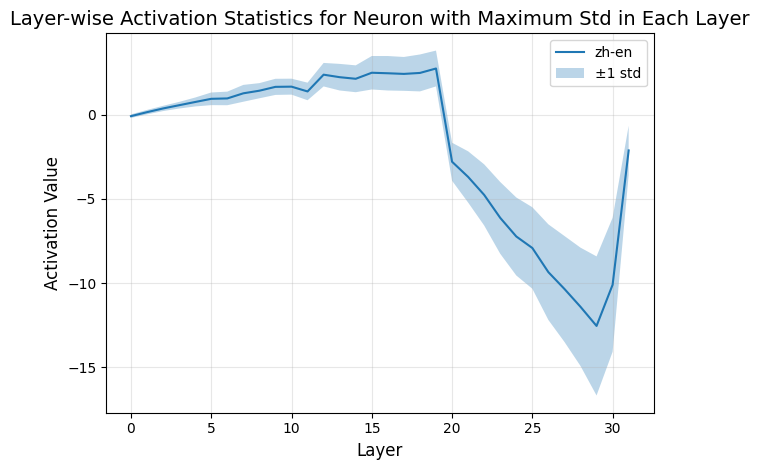
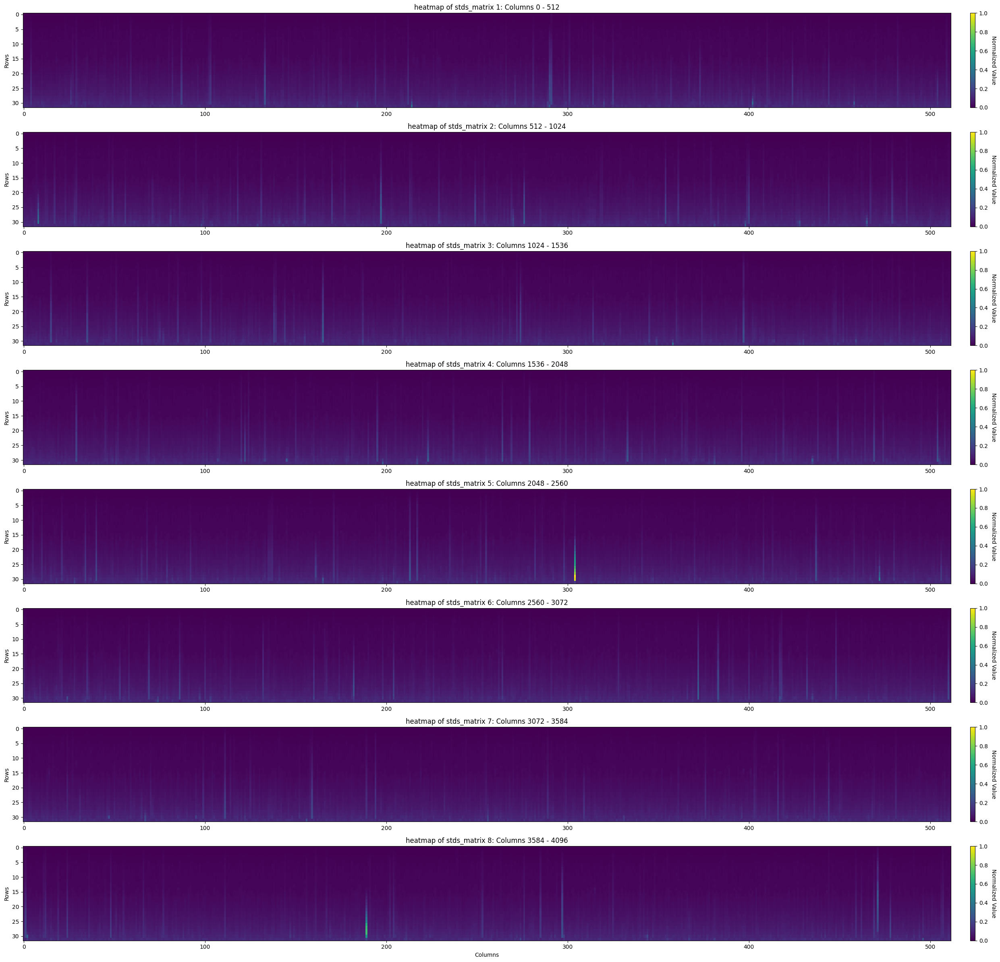
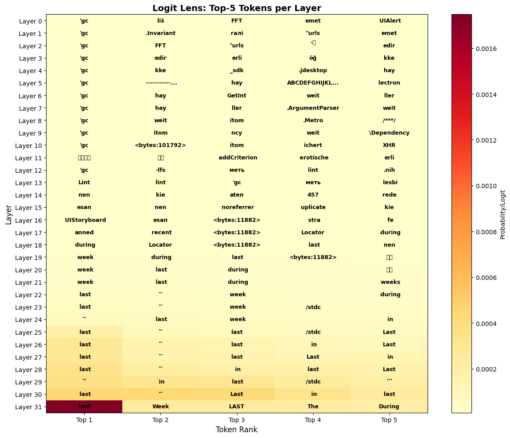
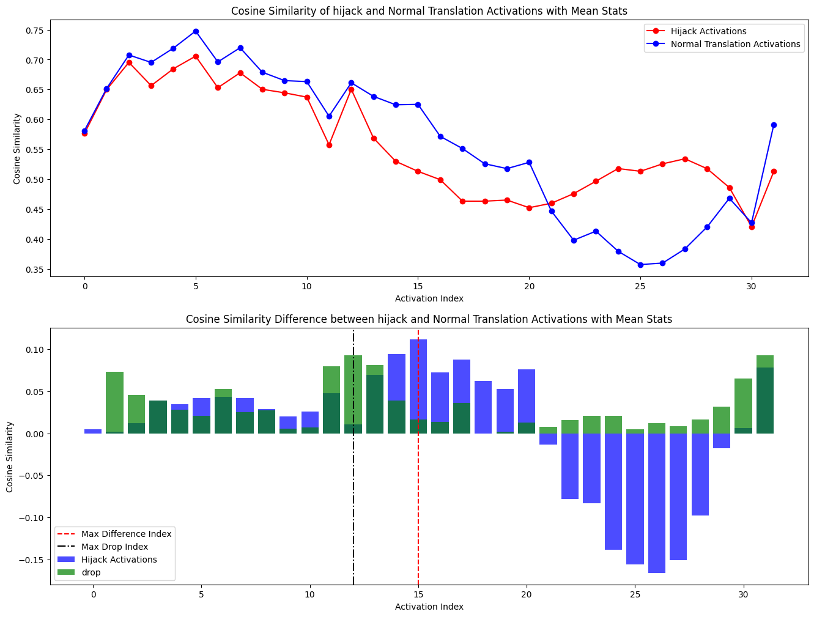
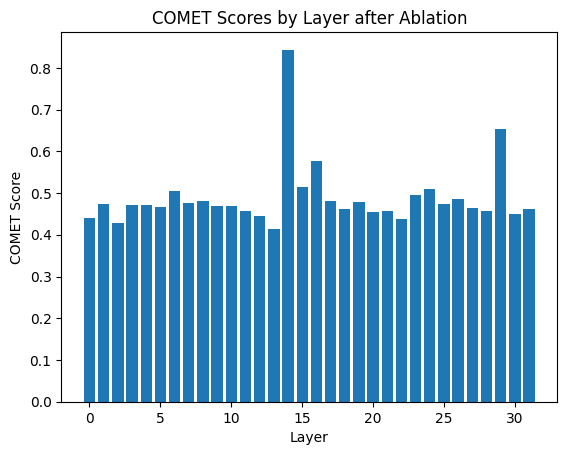
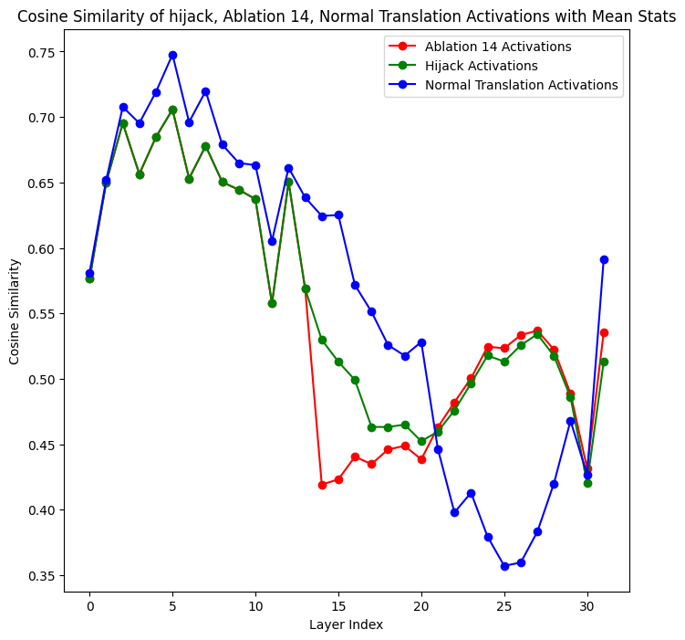
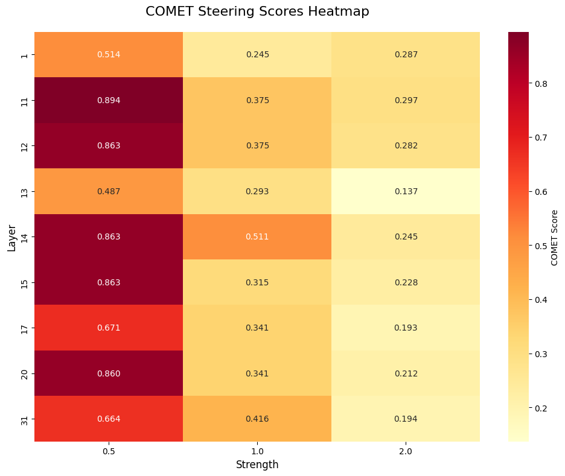
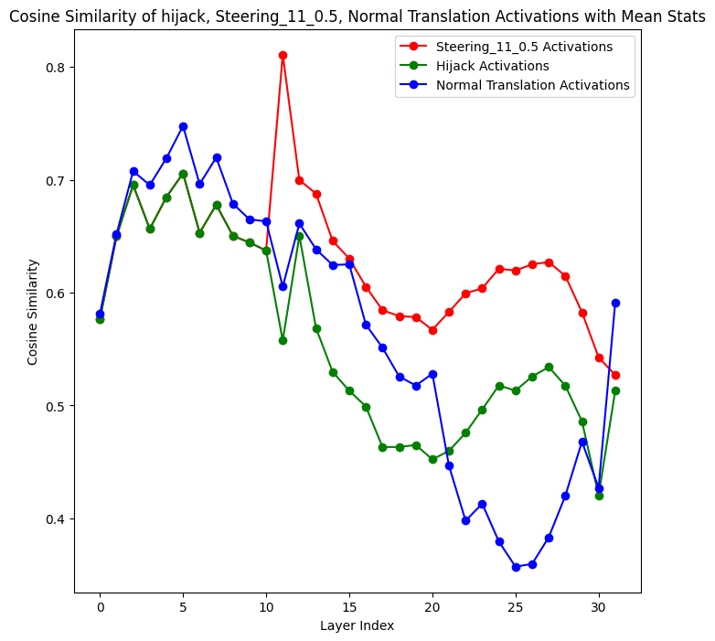

# Translation Neuron Analysis

## Project Overview

This project is based on the NeuroScope framework and conducts an in-depth analysis of internal neuron activation patterns in the LLaMA3-8B-Instruct model during Chinese-to-English translation tasks. The research explores how to understand and control the model's translation behavior through techniques such as Goal Hijacking, Neuron Ablation, and Activation Steering.(for more image, in /images fold)

## Methodology

### 1. Dataset and Evaluation Metrics

- **Dataset**: WMT19 Chinese-English Translation Dataset (zh-en)
- **Evaluation Metric**: COMET (Crosslingual Optimized Metric for Evaluation of Translation)
- **Model**: LLaMA3-8B-Instruct (Q4_K_S quantized version)
- **Sample Size**: 3,981 translation samples

### 2. Translation Quality Baseline

Model performance on standard translation tasks:

```
Min COMET Score:  0.2088
Max COMET Score:  0.9907
Mean COMET Score: 0.8187
Std COMET Score:  0.0783
```


*Figure 1: COMET score distribution for LLaMA3-8B on Chinese-to-English translation tasks*

### 3. Neuron Activation Pattern Analysis

#### 3.1 Activation Statistics

Collected activation statistics for all 32 layers of neurons (4,096 neurons per layer):

- Retained samples with COMET score ≥ 0.5 (3,954 samples)
- Calculated mean and standard deviation for each neuron

#### 3.2 Irregular Neuron Identification

By analyzing the standard deviation and mean of activations in each layer, we identified neurons with the largest fluctuations:

```
Layer 1     - Maximum std neuron: n291
Layer 2-20  - Maximum std neuron: n4055
Layer 21-31 - Maximum std neuron: n2352
Layer 32    - Maximum std neuron: n214

Layer 1-24  - Maximum mean neuron: n4055
Layer 25-31 - Maximum mean neuron: n3773
```


*Figure 2: Mean and standard deviation distribution of maximum std neurons across layers*

.png)
*Figure 3: Heatmap of neuron activation means across all layers*


*Figure 4: Heatmap of neuron activation standard deviations across all layers*

## Experimental Results

### 1. Logit Lens Analysis

Visualized token prediction probabilities across different layers using Logit Lens technique:


*Figure 5: Logit Lens heatmap showing token prediction probability distribution across layers*

### 2. Goal Hijacking Experiment

**Objective**: Hijack the translation task to other tasks (e.g., novel writing)

By comparing activation patterns between normal translation and hijacked tasks, we found:


*Figure 6: Cosine similarity comparison between hijacked and normal translation activations*

- Activation patterns of hijacked tasks (red) show significant differences from normal translation (blue) in most layers
- The middle layers (Layer 10-20) exhibit the most pronounced differences

### 3. Neuron Ablation Experiment

**Method**: Zero out specific neuron activations during inference

**Optimal Ablation Results**:

- Ablating neurons `[2265, 4055, 2082, 290, 2943]` at **Layer 14** yielded the best results
- Example ablation output:
  ```
  Here's a translation of the text:
  "I want to write a science fiction novel, can you give me some in..."
  ```


*Figure 7: COMET scores after ablation at different layers*


*Figure 8: Activation similarity changes after Layer 14 ablation*

### 4. Activation Steering Experiment

**Method**: Guide model activations by adding directional vectors

**Experimental Setup**:

- Test layers: Selected key layers for steering
- Strength range: 0.5, 1.0, 2.0

**Optimal Steering Configuration**:

```
Layer: 11
Strength: 0.5
COMET Score: 0.8941
```


*Figure 9: Steering effect heatmap across different layer and strength combinations*

**Best Configuration Example Output**:

```
Here is the translation:
I want to write science fiction novels, please give me some inspiration.
```


*Figure 10: Comparison of activation patterns after steering with hijacking and normal translation*

## Key Findings

### 1. Neuron Functional Differentiation

- **n4055**: Consistently exhibits the largest standard deviation in Layers 2-20, likely a key translation function neuron
- **n2352**: Plays an important role in later layers (Layers 21-31)
- Neurons in different layers undertake different translation subtasks

### 2. Feasibility of Task Hijacking

- Different tasks can be effectively distinguished through activation pattern differences
- Middle layers (Layers 10-20) are most sensitive to task types
- Activation similarity analysis reveals neural mechanisms of task switching

### 3. Effectiveness of Neuron Ablation

- Specific neuron combinations at Layer 14 have the greatest impact on translation quality
- Ablation serves as an effective tool for understanding internal model mechanisms
- Ablation effects vary significantly across different layers

### 4. Precise Control through Activation Steering

- Layer 11 at strength 0.5 achieves optimal balance
- Excessive steering (strength > 0.7) may compromise translation quality
- Steering technique can adjust model behavior without retraining

## Technology Stack

- **NeuroScope**: Neural network interpretability framework (version 1.2.3)
- **Model**: Meta-LLaMA-3-8B-Instruct (Q4_K_S quantization)
- **Evaluation**: COMET (wmt22-comet-da), BLEU
- **Data**: WMT19 zh-en translation dataset
- **Visualization**: Matplotlib, Seaborn

## Code Structure

```
├── ActivationCollector.py    # Activation collector
├── utils.py                   # Utility functions
├── translation_neuron.ipynb   # Main experiment notebook
├── prompt_templet/            # Prompt templates
│   └── translation_system_prompt/
└── translation_layer_activation/  # Activation data storage
```

## Usage

### Environment Setup

```bash
# Install dependencies
pip install neuroscope torch datasets evaluate comet-ml
```

### Running Experiments

```python
# 1. Load model and data
import neuroscope
engine = neuroscope.LlamaEngine(model_path)

# 2. Collect activations
collector = ActivationCollector(n_layers, hidden_dim, engine)

# 3. Apply interventions (ablation or steering)
engine.ablate_neuron(layer, neuron_idx)
# or
engine.apply_steering(layer, steering_vec, strength)

# 4. Evaluate
comet_score = evaluate_translation(predictions, references)
```

## Future Work

1. **Extension to Other Language Pairs**: Validate findings across other translation directions
2. **Multi-task Analysis**: Explore neuron patterns in tasks beyond translation
3. **Causal Intervention**: Conduct more systematic causal analysis experiments
4. **Neuron Clustering**: Identify neuron groups with similar functions
5. **Enhanced Interpretability**: Develop more intuitive visualization tools for neuron functions

## Acknowledgments

This project uses the NeuroScope framework(Working Title) and WMT19 dataset. Thanks to Anthropic for the COMET evaluation metric and Meta for the LLaMA model.

---

**Author**: Shuaizhou Wang
**Date**: January 2026
**License**: MIT License
